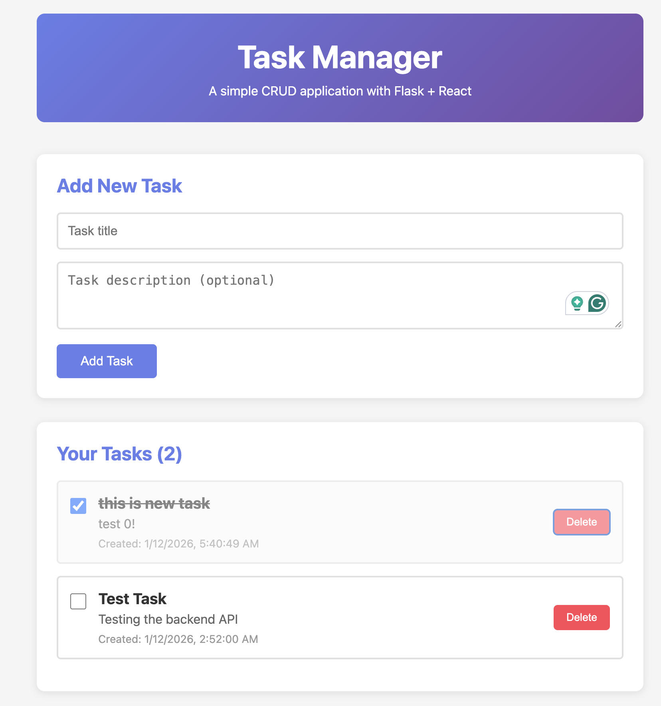

# Task Manager - Flask + React Web Application

A full-stack web application with Flask backend and React frontend demonstrating CRUD operations.

## UI Screenshot



## Features

- RESTful API with Flask
- React frontend with modern hooks (useState, useEffect)
- SQLite database with SQLAlchemy ORM
- Full CRUD operations (Create, Read, Update, Delete)
- Task management with completion tracking
- Beautiful UI with gradient header and responsive design

## Project Structure

```
playground/
├── backend/                    # Flask backend
│   ├── app.py                 # Main Flask app with API routes
│   ├── models.py              # SQLAlchemy Task model
│   ├── config.py              # Configuration
│   ├── requirements.txt       # Python dependencies
│   └── instance/              # SQLite database (auto-created)
│
├── frontend/                   # React frontend
│   ├── src/
│   │   ├── App.jsx           # Main React component
│   │   ├── App.css           # Styles
│   │   ├── main.jsx          # React entry point
│   │   ├── components/       # React components
│   │   │   ├── TaskForm.jsx
│   │   │   ├── TaskItem.jsx
│   │   │   └── TaskList.jsx
│   │   └── services/
│   │       └── api.js        # API client
│   ├── index.html
│   ├── package.json
│   └── vite.config.js
│
└── README.md                   # This file
```

## Prerequisites

- Python 3.7+
- Node.js 18+ and npm (install from https://nodejs.org/)

## Installation & Setup

### 1. Backend Setup (Flask)

```bash
# Navigate to backend directory
cd backend

# Create virtual environment
python3 -m venv venv

# Activate virtual environment
source venv/bin/activate  # On macOS/Linux
# or on Windows: venv\Scripts\activate

# Install dependencies
pip install -r requirements.txt

# Run the Flask server
python app.py
```

The backend will start on `http://localhost:5000`

### 2. Frontend Setup (React)

Open a new terminal:

```bash
# Navigate to frontend directory
cd frontend

# Install dependencies
npm install

# Run the development server
npm run dev
```

The frontend will start on `http://localhost:5173`

## Usage

1. Open your browser to `http://localhost:5173`
2. You'll see the Task Manager interface
3. Add a new task using the form (title is required, description is optional)
4. Click the checkbox to mark a task as complete
5. Click "Delete" to remove a task
6. Refresh the page - your data persists in the SQLite database!

## API Endpoints

All API endpoints are prefixed with `/api`:

- `GET /api/tasks` - Get all tasks
- `GET /api/tasks/<id>` - Get a single task
- `POST /api/tasks` - Create a new task
- `PUT /api/tasks/<id>` - Update a task
- `DELETE /api/tasks/<id>` - Delete a task
- `GET /api/health` - Health check

## Testing the API

You can test the API using curl:

```bash
# Health check
curl http://localhost:5000/api/health

# Create a task
curl -X POST http://localhost:5000/api/tasks \
  -H "Content-Type: application/json" \
  -d '{"title": "Test Task", "description": "Testing the API"}'

# Get all tasks
curl http://localhost:5000/api/tasks

# Update a task (replace 1 with actual task ID)
curl -X PUT http://localhost:5000/api/tasks/1 \
  -H "Content-Type: application/json" \
  -d '{"title": "Updated Task", "completed": true}'

# Delete a task (replace 1 with actual task ID)
curl -X DELETE http://localhost:5000/api/tasks/1
```

## Technology Stack

**Backend:**
- Flask 3.0.0 - Web framework
- Flask-CORS 4.0.0 - Cross-Origin Resource Sharing
- Flask-SQLAlchemy 3.1.1 - ORM for database operations
- SQLite - Database

**Frontend:**
- React 18.2.0 - UI library
- Vite 5.0.8 - Build tool and dev server
- Axios 1.6.0 - HTTP client

## Development Notes

- The backend runs on port 5000
- The frontend runs on port 5173
- CORS is configured to allow requests from the frontend
- Data persists in `backend/instance/tasks.db`
- Both servers must be running for the app to work

## Troubleshooting

**Port already in use:**
```bash
# Kill process on port 5000 (backend)
lsof -ti:5000 | xargs kill -9

# Kill process on port 5173 (frontend)
lsof -ti:5173 | xargs kill -9
```

**Cannot connect to backend:**
- Ensure Flask server is running on port 5000
- Check console for CORS errors
- Verify backend terminal shows no errors

**Module not found errors:**
- Backend: Activate virtual environment and reinstall dependencies
- Frontend: Run `npm install` in the frontend directory

## Deployment

This application is configured for deployment on multiple platforms:

### Render (Backend)
- Configuration: `render.yaml`
- Automatically deploys Flask backend as a web service
- Uses Gunicorn for production serving
- SQLite database included

### Vercel (Frontend)
- Configuration: `vercel.json`
- Automatically deploys React frontend
- Optimized build with Vite
- Update `VITE_API_URL` in frontend before deploying

## Changelog

### 2026-01-13
- Added deployment configuration for Render (backend) and Vercel (frontend)
- Added `render.yaml` with Flask backend deployment settings using Gunicorn
- Added `vercel.json` with React frontend deployment settings
- Added comprehensive `DEPLOYMENT.md` guide with step-by-step instructions
- Added `frontend/.env.example` for environment variable configuration
- Added `auto_commit.sh` automation script for AI-assisted daily updates
- Added UI screenshot to README showing the task manager interface
- Updated README with deployment instructions and troubleshooting guide

### Initial Release
- Full-stack task manager with Flask backend and React frontend
- RESTful API with CRUD operations
- SQLite database with SQLAlchemy ORM
- Responsive UI with gradient design
- Task completion tracking

## Next Steps

Consider adding:
- User authentication
- Task categories or tags
- Due dates and priorities
- Search and filtering
- Pagination for large task lists
- Dark mode toggle
- Unit and integration tests
